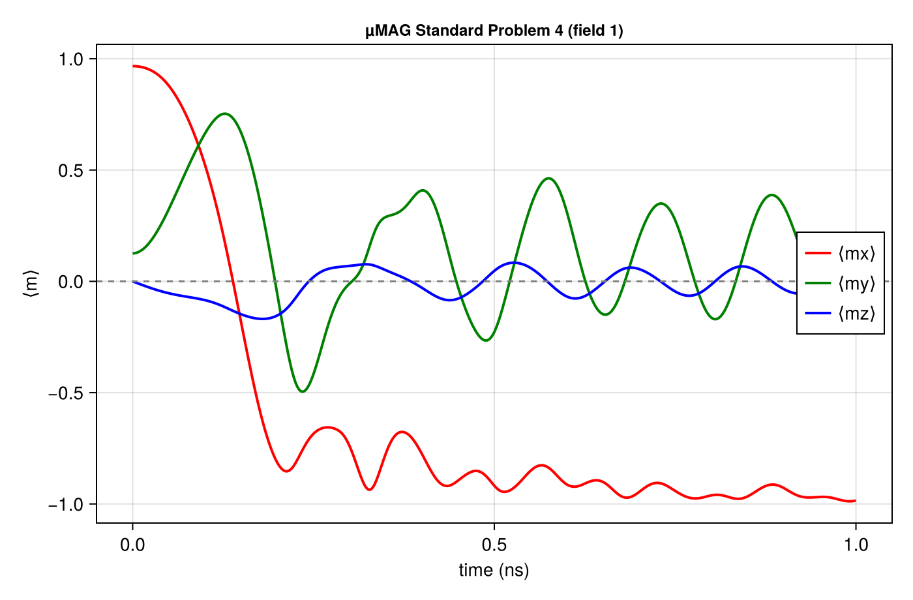
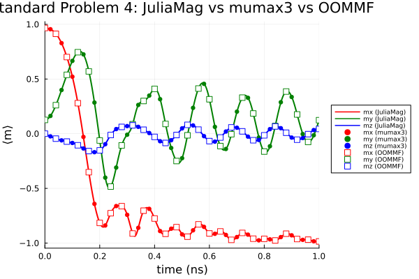

# JuliaMag

Micromagnetic simulation in pure Julia, on CPU and (later) GPU.

Inspired by [mumax3](https://github.com/mumax/3) (Vansteenkiste et al., *AIP Advances* **4**, 107133 (2014)),
but written from scratch to take advantage of Julia's multiple dispatch.

## Design

The reduced magnetization `m = M / Msat` is an `Array{T,4}` of shape `(3, Nx, Ny, Nz)`.
The vector component is the fastest-varying index, so `m[:, i, j, k]` is contiguous
and the array maps directly onto a `CuArray`.

Every routine dispatches on the array type. A CPU run passes an `Array`, a GPU run
passes a `CuArray`, and the correct method is selected — no separate code path, no
`if gpu` branches. The element type `T` is propagated too, so `Float32` on the GPU
comes for free.

Index convention is `(x, y, z)`, 1-based, everywhere.

## Status

Under construction. Roadmap:

- [x] **1.** Package skeleton, `Mesh`, `Material`, magnetization states
- [x] **2.** Exchange, uniaxial anisotropy, Zeeman fields (+ interfacial & bulk DMI)
- [x] **3.** Demagnetization kernel (Newell / brute-force integration)
- [x] **4.** Demagnetization field via FFT convolution
- [x] **5.** LLG torque + adaptive RK45 solver + energy minimizer + OrdinaryDiffEq integration
- [x] **6.** µMAG standard problem 4 ([`examples/`](examples/stdproblem4.jl))
- [x] **7.** Energies (exchange, demag, anisotropy, DMI, Zeeman) for convergence checking
- [x] Spin-transfer torque (Zhang-Li, Slonczewski)
- [x] Bulk DMI validated term-by-term against mumax3
- [x] Initial states (uniform, vortex, antivortex, vortex wall, two-domain,
      random, Néel/Bloch skyrmion) + OVF loading
- [ ] Geometries / regions
- [ ] OVF I/O and output tables
- [ ] GPU (CuArray) — the dispatch design is ready for it

## Usage

```julia
using JuliaMag

# µMAG standard problem 4 geometry: 500 × 125 × 3 nm
mesh = Mesh((160, 40, 1), (3.125e-9, 3.125e-9, 3e-9))

# Permalloy
mat = Material(Msat = 8.0e5, Aex = 1.3e-11, alpha = 0.02)

m = uniform(mesh, (1, 0, 0))
average(m)   # (1.0, 0.0, 0.0)
```

## Standard problem 4

[`examples/stdproblem4.jl`](examples/stdproblem4.jl) runs the µMAG standard
problem 4: relax a 500 × 125 × 3 nm Permalloy film to its S-state (energy
minimizer), apply field 1 (−24.6, 4.3, 0 mT), and integrate the switching for
1 ns. It writes `stdproblem4.txt` (⟨m⟩ vs t) and this figure:



⟨mx⟩ crosses zero at ~0.14 ns and rings down to −1, ⟨my⟩ peaks near +0.75 —
matching the published µMAG reference curves.

```
julia --project=examples examples/stdproblem4.jl
```

Compared directly against **both** mumax3 and OOMMF reference runs
([`compare_mumax3.jl`](examples/compare_mumax3.jl)), the curves coincide to
within max |Δ| ≈ 0.004 (RMS ≲ 0.002) for all three components over the full
nanosecond — JuliaMag as solid lines, mumax3 as circles, OOMMF as open squares:



## Tests

```
julia --project=. -e 'using Pkg; Pkg.test()'
```

## Legacy

`legacy/` holds the earlier exploratory code this package replaces. It is kept for
reference only and is not loaded by the package.

## Author

Rafael L. Novak — rlnovak@gmail.com — UFSC/Blumenau, Brazil
